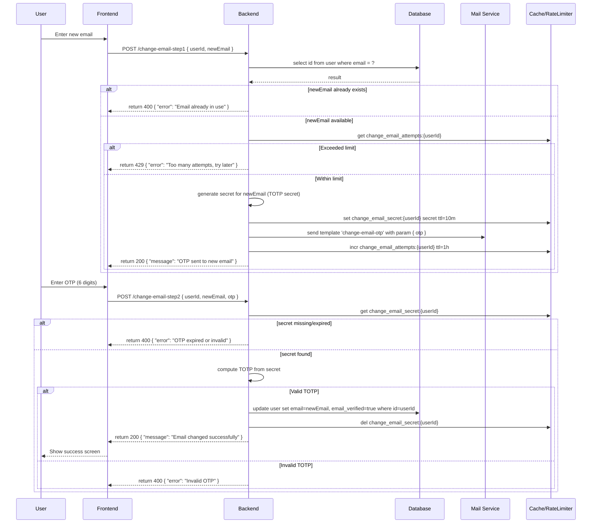

```mermaid
sequenceDiagram
    participant U as User
    participant FE as Frontend
    participant BE as Backend
    participant DB as Database
    participant MS as Mail Service
    participant Cache as Cache/RateLimiter

    U->>FE: Enter new email
    FE->>BE: POST /change-email-step1 { userId, newEmail }

    BE->>DB: select id from user where email = ?
    DB-->>BE: result
    alt newEmail already exists
        BE-->>FE: return 400 { "error": "Email already in use" }
    else newEmail available
        BE->>Cache: get change_email_attempts:{userId}
        alt Exceeded limit
            BE-->>FE: return 429 { "error": "Too many attempts, try later" }
        else Within limit
            BE->>BE: generate secret for newEmail (TOTP secret)
            BE->>Cache: set change_email_secret:{userId} secret ttl=10m
            BE->>MS: send template 'change-email-otp' with param { otp }
            BE->>Cache: incr change_email_attempts:{userId} ttl=1h
            BE-->>FE: return 200 { "message": "OTP sent to new email" }
        end
    end

    U->>FE: Enter OTP (6 digits)
    FE->>BE: POST /change-email-step2 { userId, newEmail, otp }

    BE->>Cache: get change_email_secret:{userId}
    alt secret missing/expired
        BE-->>FE: return 400 { "error": "OTP expired or invalid" }
    else secret found
        BE->>BE: compute TOTP from secret
        alt Valid TOTP
            BE->>DB: update user set email=newEmail, email_verified=true where id=userId
            BE->>Cache: del change_email_secret:{userId}
            BE-->>FE: return 200 { "message": "Email changed successfully" }
            FE-->>U: Show success screen
        else Invalid TOTP
            BE-->>FE: return 400 { "error": "Invalid OTP" }
        end
    end
```
