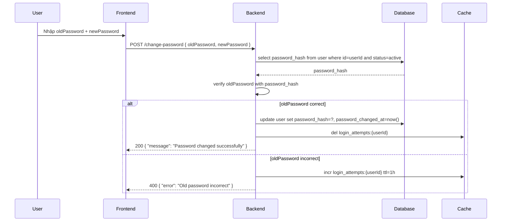

```mermaid
sequenceDiagram
    participant U as User
    participant FE as Frontend
    participant BE as Backend
    participant DB as Database
    participant Cache as Cache

    U->>FE: Nhập oldPassword + newPassword
    FE->>BE: POST /change-password { oldPassword, newPassword }

    BE->>DB: select password_hash from user where id=userId and status=active
    DB-->>BE: password_hash

    BE->>BE: verify oldPassword with password_hash
    alt oldPassword correct
        BE->>DB: update user set password_hash=?, password_changed_at=now()
        BE->>Cache: del login_attempts:{userId}
        BE-->>FE: 200 { "message": "Password changed successfully" }
    else oldPassword incorrect
        BE->>Cache: incr login_attempts:{userId} ttl=1h
        BE-->>FE: 400 { "error": "Old password incorrect" }
    end
```
