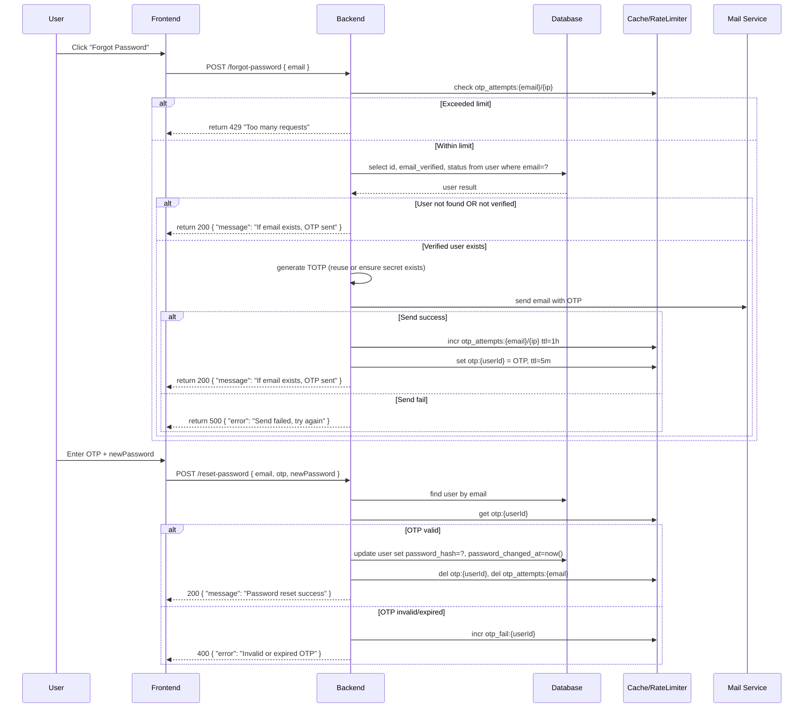

```mermaid
sequenceDiagram
    participant U as User
    participant FE as Frontend
    participant BE as Backend
    participant DB as Database
    participant Cache as Cache/RateLimiter
    participant MS as Mail Service

    U->>FE: Click "Forgot Password"
    FE->>BE: POST /forgot-password { email }

    BE->>Cache: check otp_attempts:{email}/{ip}
    alt Exceeded limit
        BE-->>FE: return 429 "Too many requests"
    else Within limit
        BE->>DB: select id, email_verified, status from user where email=?
        DB-->>BE: user result

        alt User not found OR not verified
            BE-->>FE: return 200 { "message": "If email exists, OTP sent" } 
        else Verified user exists
            BE->>BE: generate TOTP (reuse or ensure secret exists)
            BE->>MS: send email with OTP
            alt Send success
                BE->>Cache: incr otp_attempts:{email}/{ip} ttl=1h
                BE->>Cache: set otp:{userId} = OTP, ttl=5m
                BE-->>FE: return 200 { "message": "If email exists, OTP sent" }
            else Send fail
                BE-->>FE: return 500 { "error": "Send failed, try again" }
            end
        end
    end

    U->>FE: Enter OTP + newPassword
    FE->>BE: POST /reset-password { email, otp, newPassword }

    BE->>DB: find user by email
    BE->>Cache: get otp:{userId}
    alt OTP valid
        BE->>DB: update user set password_hash=?, password_changed_at=now()
        BE->>Cache: del otp:{userId}, del otp_attempts:{email}
        BE-->>FE: 200 { "message": "Password reset success" }
    else OTP invalid/expired
        BE->>Cache: incr otp_fail:{userId}
        BE-->>FE: 400 { "error": "Invalid or expired OTP" }
    end
```
