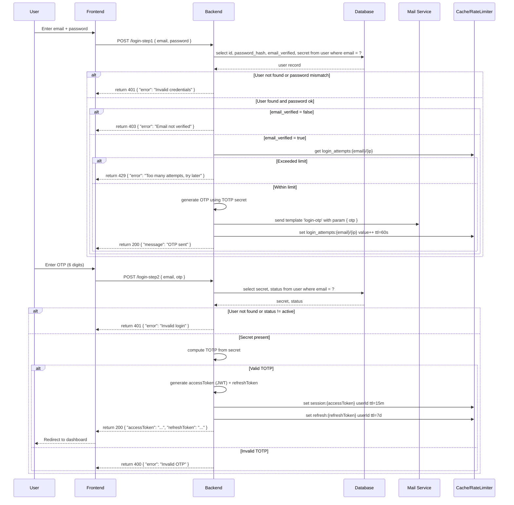

```mermaid
sequenceDiagram
    participant U as User
    participant FE as Frontend
    participant BE as Backend
    participant DB as Database
    participant MS as Mail Service
    participant Cache as Cache/RateLimiter

    U->>FE: Enter email + password
    FE->>BE: POST /login-step1 { email, password }
    BE->>DB: select id, password_hash, email_verified, secret from user where email = ?
    DB-->>BE: user record

    alt User not found or password mismatch
        BE-->>FE: return 401 { "error": "Invalid credentials" }
    else User found and password ok
        alt email_verified = false
            BE-->>FE: return 403 { "error": "Email not verified" }
        else email_verified = true
            BE->>Cache: get login_attempts:{email}/{ip}
            alt Exceeded limit
                BE-->>FE: return 429 { "error": "Too many attempts, try later" }
            else Within limit
                BE->>BE: generate OTP using TOTP secret
                BE->>MS: send template 'login-otp' with param { otp }
                BE->>Cache: set login_attempts:{email}/{ip} value++ ttl=60s
                BE-->>FE: return 200 { "message": "OTP sent" }
            end
        end
    end

    U->>FE: Enter OTP (6 digits)
    FE->>BE: POST /login-step2 { email, otp }
    BE->>DB: select secret, status from user where email = ?
    DB-->>BE: secret, status

    alt User not found or status != active
        BE-->>FE: return 401 { "error": "Invalid login" }
    else Secret present
        BE->>BE: compute TOTP from secret
        alt Valid TOTP
            BE->>BE: generate accessToken (JWT) + refreshToken
            BE->>Cache: set session:{accessToken} userId ttl=15m
            BE->>Cache: set refresh:{refreshToken} userId ttl=7d
            BE-->>FE: return 200 { "accessToken": "...", "refreshToken": "..." }
            FE-->>U: Redirect to dashboard
        else Invalid TOTP
            BE-->>FE: return 400 { "error": "Invalid OTP" }
        end
    end

```
