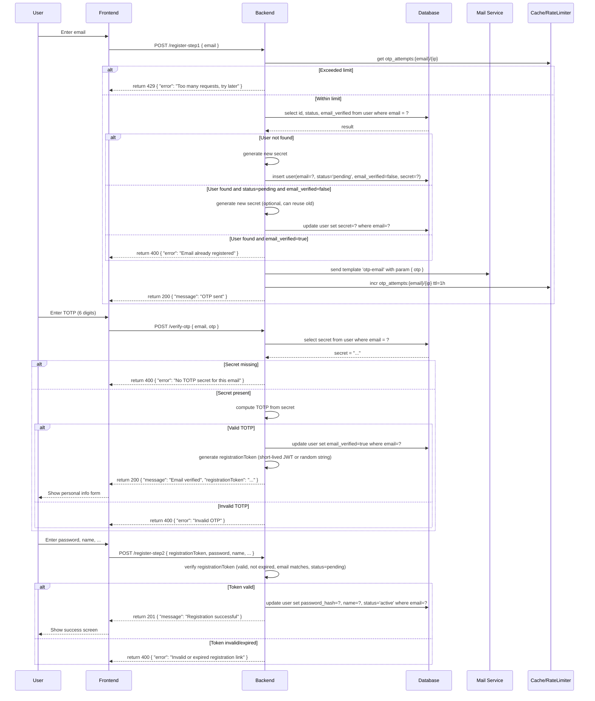

```mermaid
sequenceDiagram
    participant U as User
    participant FE as Frontend
    participant BE as Backend
    participant DB as Database
    participant MS as Mail Service
    participant Cache as Cache/RateLimiter

    U->>FE: Enter email
    FE->>BE: POST /register-step1 { email }

    BE->>Cache: get otp_attempts:{email}/{ip}
    alt Exceeded limit
        BE-->>FE: return 429 { "error": "Too many requests, try later" }
    else Within limit
        BE->>DB: select id, status, email_verified from user where email = ?
        DB-->>BE: result

        alt User not found
            BE->>BE: generate new secret
            BE->>DB: insert user(email=?, status='pending', email_verified=false, secret=?)
        else User found and status=pending and email_verified=false
            BE->>BE: generate new secret (optional, can reuse old)
            BE->>DB: update user set secret=? where email=?
        else User found and email_verified=true
            BE-->>FE: return 400 { "error": "Email already registered" }
        end

        BE->>MS: send template 'otp-email' with param { otp }
        BE->>Cache: incr otp_attempts:{email}/{ip} ttl=1h
        BE-->>FE: return 200 { "message": "OTP sent" }
    end

    U->>FE: Enter TOTP (6 digits)
    FE->>BE: POST /verify-otp { email, otp }
    BE->>DB: select secret from user where email = ?
    DB-->>BE: secret = "..."
    alt Secret missing
        BE-->>FE: return 400 { "error": "No TOTP secret for this email" }
    else Secret present
        BE->>BE: compute TOTP from secret
        alt Valid TOTP
            BE->>DB: update user set email_verified=true where email=?
            BE->>BE: generate registrationToken (short-lived JWT or random string)
            BE-->>FE: return 200 { "message": "Email verified", "registrationToken": "..." }
            FE-->>U: Show personal info form
        else Invalid TOTP
            BE-->>FE: return 400 { "error": "Invalid OTP" }
        end
    end
    
    U->>FE: Enter password, name, ...
    FE->>BE: POST /register-step2 { registrationToken, password, name, ... }
    BE->>BE: verify registrationToken (valid, not expired, email matches, status=pending)
    alt Token valid
        BE->>DB: update user set password_hash=?, name=?, status='active' where email=?
        BE-->>FE: return 201 { "message": "Registration successful" }
        FE-->>U: Show success screen
    else Token invalid/expired
        BE-->>FE: return 400 { "error": "Invalid or expired registration link" }
    end
```
